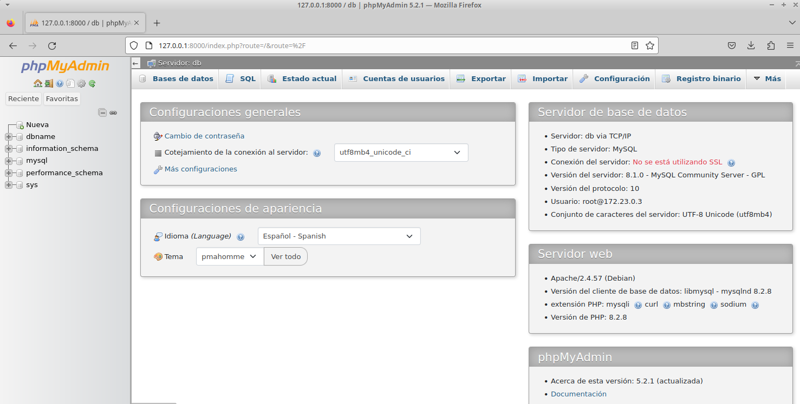
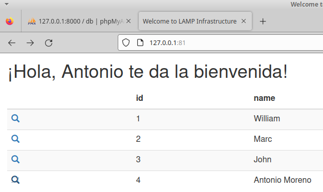

# 
Tarea 2: LAMP con Docker en una máquina

*- Primero descargo el git del docker-lamp y lo guardo en una ruta que tenga disponible o haya creado*

 

*- Después levanto el docker con `docker-compose up` y espero todo el proceso que es longevo y no debería fallar en un principio, si tienes los puertos que usan estos docker en uso dará error, en ese caso o los cambias en el fichero .yml o detienes esos procesos que estén usando dichos puertos*

 

*- Si todo funciona y hago un `docker ps` para ver los docker que estén en marcha aparecen los tres docker que deben aparecer, el de phpmyadmin, el www y el db_1 que es el mysql*

 

*- Aquí accedo al phpmyadmin con las credenciales correspondientes que son el usuario root con la contraseña test, esto es así porque está configurado de esta forma en el archivo .yml, lo veremos más abajo

 

 

*- Este es el fichero "docker-compose.yml", voy a ir paso a paso lo que realiza cada línea:*

 

version: "3.1": Esta línea especifica la versión de Docker Compose que se está utilizando. En este caso, se utiliza la versión 3.1.

services: Esta sección define los servicios o contenedores que compondrán tu aplicación.

db: Este servicio usa la imagen oficial de MySQL. Sus configuraciones son:
image: mysql: Especifica la imagen de Docker que se utilizará para este servicio, en este caso, MySQL.
ports: Mapea el puerto 3306 del contenedor MySQL al puerto 3307 del sistema anfitrión, lo que permite acceder a la base de datos desde fuera del contenedor.
command: Define una opción para el comando de inicio del contenedor. En este caso, se establece --default-authentication-plugin=mysql_native_password para configurar la autenticación nativa de MySQL.
environment: Configura variables de entorno para el contenedor. Define el nombre de la base de datos, la contraseña de la base de datos y la contraseña de root.
volumes: Configura volúmenes para persistencia de datos. Se utilizan para montar los directorios locales ./dump, ./conf, y persistent dentro del contenedor.
networks: Conecta el servicio a la red llamada default.

www: Este servicio se crea a partir de un Dockerfile local (que debería estar en el mismo directorio). Sus configuraciones son: 
build: Especifica que la imagen se construirá a partir del contexto local (directorio actual) utilizando el Dockerfile local.
ports: Mapea el puerto 80 del contenedor al puerto 80 del sistema anfitrión, lo que permite acceder a la aplicación web desde fuera del contenedor.
volumes: Monta el directorio local ./www dentro del contenedor en /var/www/html.
links: Establece una dependencia entre este servicio y el servicio db.
networks: Conecta el servicio a la red llamada default.

phpmyadmin: Este servicio utiliza la imagen oficial de phpMyAdmin y se configura de la siguiente manera:
image: phpmyadmin/phpmyadmin: Utiliza la imagen oficial de phpMyAdmin.
links: Establece una dependencia entre este servicio y el servicio db, permitiendo que phpMyAdmin se comunique con la base de datos.
ports: Mapea el puerto 80 del contenedor phpMyAdmin al puerto 8000 del sistema anfitrión.
environment: Configura las credenciales de MySQL (usuario root y contraseña) para phpMyAdmin.

volumes: Esta sección define un volumen llamado persistent. Los volúmenes se utilizan para persistir datos en los contenedores. En este caso, el volumen se asocia con el servicio db, lo que significa que los datos de la base de datos MySQL se almacenarán en este volumen para que persistan entre reinicios del contenedor.

*- Y este es el contenido del Dockerfile que consiste en lo siguiente:*

 

FROM php:8.0.0-apache: Esta línea establece la imagen base en la que se basará la nueva imagen. En este caso, se utiliza la imagen oficial de PHP 8.0 con Apache.

ARG DEBIAN_FRONTEND=noninteractive: Esta línea define una variable de construcción llamada DEBIAN_FRONTEND y la establece en noninteractive. Esto se utiliza para evitar que las herramientas de instalación de paquetes interactúen con el usuario y ejecuten en modo no interactivo.

RUN docker-php-ext-install mysqli: Este comando instala la extensión mysqli en la imagen de PHP. La extensión mysqli se utiliza para interactuar con bases de datos MySQL desde PHP.

Las siguientes líneas instalan varias dependencias y extensiones PHP, así como habilitan módulos de Apache:

libpng-dev, libzip-dev, zlib1g-dev, libonig-dev: Estos comandos instalan las bibliotecas y encabezados necesarios para compilar extensiones PHP y realizar operaciones con archivos y cadenas.

docker-php-ext-install zip: Instala la extensión zip de PHP, que proporciona funcionalidad para trabajar con archivos comprimidos en formato ZIP.

docker-php-ext-install mbstring: Instala la extensión mbstring de PHP, que proporciona funciones para manipular cadenas multibyte.

docker-php-ext-install gd: Instala la extensión gd de PHP, que se utiliza para manipular imágenes.

a2enmod rewrite: Habilita el módulo rewrite de Apache, que permite la reescritura de URL. Esto es comúnmente utilizado en aplicaciones web para configurar rutas amigables y redirecciones.
