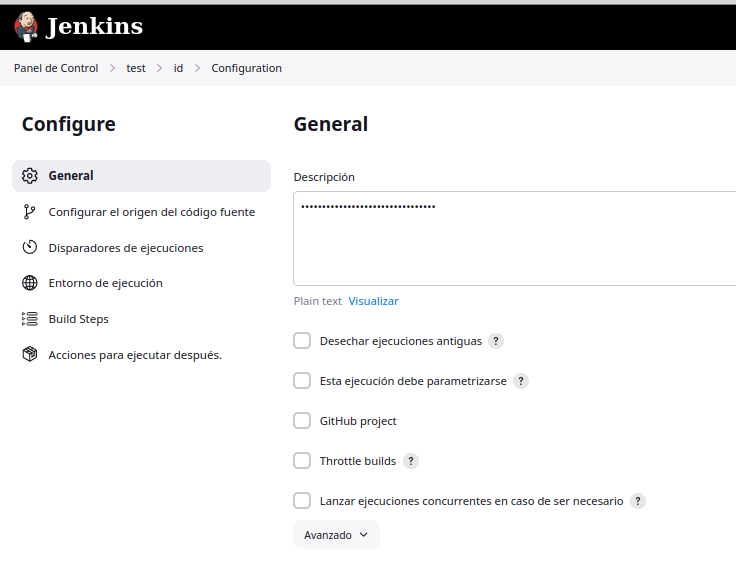

# 
Tarea 1 Job Básico

Creo la carpeta test

 

&nbsp;

Ahora dentro de ella creo el proyecto de estilo libre que lo he llamado id

 

Ahora dentro de id pongo lo necesario para que se ejecute periódicamente:

 

Ahora hago el script que necesito para realizar las comprobaciones necesarias y pongo el código en Build Steps, después abajo del todo pongo el correo al que quiero que sean recibidas las notificaciones.

 

Tras esto nos vamos a Administrar Jenkins y en System ponemos lo siguiente:

 

 

Podemos probar la configuración enviando un mensaje de prueba a una dirección de correo haciendo esto:

 

Y si todo ha funcionado nos debe salir el mensaje que dice "Email was succesfully sent" y nos debería haber llegado rápidamente."

 

También tenemos que darle a jenkins unas credenciales desde gmail en el apartado de verificación de dos pasos y copiar y pegar esa contraseña

 

Ahora vamos a probar a id, dando a Construir ahora, a ver si hace lo que tiene que hacer

 

Si todo ha ido bien, nos debería haber notificado que ha llegado un error ya que lo hemos hecho así, y podemos ver el log en Console Output desde Jenkins y también desde el correo como se puede ver:

 

 
