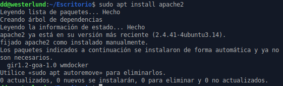
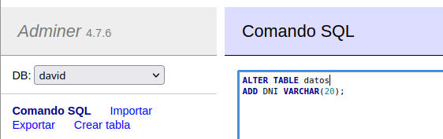
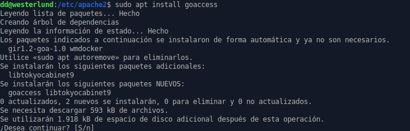

# 
Tarea 1 - LAMP en Ubuntu

## 1. Servidor Web Apache

◉ Instala el servidor Web Apache, configúralo y prueba que funciona correctamente.

*- Para instalar apache hago:*

`sudo apt install apache2` 

*- Para ver si al instalarse arranca correctamente reviso su estado con:*

`sudo systemctl status apache`

*- Posteriormente abro una pestaña del navegador, pongo en la URL mi dirección localhost (127.0.0.1) para ver si aparece el servidor Apache y ahí está.*

  
 

  
 

  
 

## 2. MySql

◉ Instala el servidor MySql y configúralo.

*- Para instalar el servidor mysql hago:*

`sudo apt install mysql-server` 

  
 

◉ Debes poder (por consola) acceder al servidor de base de datos, crear una base de datos de prueba con una tabla e insertar unos cuantos registros. Realiza una consulta para comprobar que se han insertado los registros. Entrega la explicación de los pasos seguidos junto con capturas del proceso.

*- Accedo como root ya que es el usuario por defecto sin contraseña del servidor mysql con el siguiente comando:*

`mysql -u root` 

  
 

*- Creo una base de datos de prueba con:*

`CREATE DATABASE david;` 

  
 

*- Muestro las bases de datos que tengo para ver si se ha creado la nueva con:*

`SHOW DATABASES;` 

  
 

-*Me meto en la base de datos "david"*

`USE david`

  
 

-*Comienzo a insertar los datos:*

  
 

◉ Crea un usuario con privilegios de administrador sobre la base de datos creada

  
 

  
 

  
 

  ## 3. PHP

◉ Instala última versión de PHP en tu máquina y muestra que está funcionando mostrando la información de PHP en una página web alojada en tu servicio web Apache.

  
 

 *-Meto datos en info.php para ver si lo carga en el navegador:*

  
 

  
 

  
 
 

  ◉ Bola extra! Basándote en la siguiente plantilla, realiza las
  modificaciones necesaria para establecer una conexión a tu base de datos, recuperar algun dato/s y mostrarlo en una página web que alojarás en tu servidor Apache. Entrega el fichero php y las explicaciones/capturas del proceso seguido y el resultado obtenido.

*-Instalo los paquetes necesarios, cada uno se ocupa de esto respectivamente:*

`-libapache2-mod-php`: Permite servir páginas PHP desde el servidor web apache.

`-php-mysql`: Permite conectar a una base de datos MySQL desde código PHP.

   
 
 

*-Vuelvo al archivo creado "info.php" y esta vez pongo la configuración que me ha funcionado*
   
 
 

*-Después reinicio el servicio apache*
   
 
 

*-Pongo en el navegador 127.0.0.1/info.php y si funciona te mostrará los datos tal y como lo has estructurado, sino te saldrá un mensaje de error o nada.*

   
 
 

## 4. Gestor web de Base de datos

◉ Instala PhpMyAdmin y establece conexión con tu base de datos.

   
 
 
   
 
 
   
 
 
   
 
 
   
 
 

*-Como al realizar toda la instalación y no dar error resulta que aún así no carga el phpmyadmin la solución a esto es, irnos a /etc/apache2, entrar en apache2.conf y añadir la ruta /etc/phpmyadmin/apache.conf y entonces ya debería aparecer. Reiniciamos el servidor apache tras hacer los cambios.

   
 
 
   
 
 
   
 
 
   
 
  
   
 
 

◉ Instala Adminer y establece conexión con tu base de datos.

   
 
 

   -*Se debe crear un enlace simbólico entre adminer.conf y el directorio conf-enabled de /etc/apache2 para que podamos cargar Adminer en el navegador. Despúes de esto reiniciamos el servidor apache.*

   
 
 
   
 
 

  ◉ Realiza alguna consulta así como modificación de la estructura de la base de datos (creación de columnas, modificación de tabla...) y de los datos (inserción,modificación...) utilizando el gestor de base de datos instalado.

  ### PHPMyAdmin

  
 

  
 
 
  
 

  
 

  
 
 

  ### Adminer

  
 
 
  
 
 
  
 
 
  
 
 
  
 

  
 
  

   ## 5. Analizar los logs de Apache

   ◉ Instalar un analizador de logs de Apache como GoAccess y visualizar en una página web en tiempo real la monitorización del servicio web Apache instalado. Entrega la explicación de los pasos seguidos junto con capturas del proceso.

   
 
 

*- Con el siguiente comando:* 

   
 

*- Se nos mostrará una pantalla en el terminal donde podemos elegir el formato de salida del registro. Para este ejemplo, voy a elegir la opción CLF (tercera opción).*

   
 
  

*- Tras pulsar la tecla Intro, inmediatamente comenzará el análisis.*

   
 

*- Este comando generará un archivo que se puede abrir desde el navegador. El nombre del archivo de salida, en este caso informe.html.*

   
 

   
 
