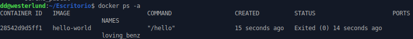

# 
Tarea 4: Primeros pasos con Docker

### Instala docker en una máquina y configúralo para que se pueda usar con un usuario sin privilegios.

`sudo apt update`

`sudo apt install -y apt-transport-https ca-certificates curl software-properties-common`

`curl -fsSL https://download.docker.com/linux/ubuntu/gpg | sudo gpg --dearmor -o /usr/share/keyrings/docker-archive-keyring.gpg`

`echo "deb [arch=amd64 signed-by=/usr/share/keyrings/docker-archive-keyring.gpg] https://download.docker.com/linux/ubuntu $(lsb_release -cs) stable" | sudo tee /etc/apt/sources.list.d/docker.list > /dev/null`

`sudo apt update`

`sudo apt install -y docker-ce docker-ce-cli containerd.io`

`sudo usermod -aG docker $USER`

  
 

---

### Ejecuta un contenedor a partir de la imagen hello-world. Comprueba que nos devuelve la salida adecuada. Comprueba que no se está ejecutando. Lista los contenedores que están parado. Borra el contenedor.

  
 

  
 

  
 

  
 

---

**Crea un contenedor interactivo desde una imagen debian. Instala un paquete por ejemplo (nano). Sal de la terminal, ¿sigue el contenedor corriendo? ¿Por qué?. Vuelve a iniciar el contenedor y accede de nuevo a él de forma interactiva. ¿Sigue instalado el nano?. Sal del contenedor, y bórralo. Crea un nuevo contenedor interactivo desde la misma imagen. ¿Tiene el nano instalado?**

El contenedor ha dejado de estar en marcha, aquí tengo los pasos que he hecho hasta salir de él:

  
 

Como se ve, no está en marcha el docker con la imagen Debian ya que el comando "docker ps" muestra los docker activos y no aparece. Esto pasa porque al decir tan solo "exit" no solo sales sino que también se detiene. He vuelto a entrar y el nano sigue instalado:

 

He creado un contenedor nuevo con la misma imagen y no ha conservado el nano

 

### Crea un contenedor demonio con un servidor nginx, usando la imagen oficial de nginx. Al crear el contenedor, ¿has tenido que indicar algún comando para que lo ejecute? Accede al navegador web y comprueba que el servidor esta funcionando. Muestra los logs del contenedor.

 

 

 

 

### Crea un contenedor con la aplicación Nextcloud, mirando la documentación en docker Hub, para personalizar el nombre de la base de datos sqlite que va a utilizar.

 

 

 He hecho un pull de nextcloud porque no lo tenía, posteriormente he creado una carpeta en la ruta para almacenar los datos del nextcloud, y después he accedido a localhost:8080 por navegador después he ejecutado el comando:

`docker run -d --name david-nextcloud -p 8080:80 -e NEXTCLOUD_ADMIN_USER=dd -e NEXTCLOUD_ADMIN_PASSWORD=dd -e SQLITE_DATABASE=david nextcloud`

 

 

 

Se ha creado todo con éxito y posteriormente he ejecutado la sentencia:

`docker exec -it david-nextcloud /bin/bash`

Con esta sentencia he entrado de forma interactiva al contenedor y he llegado hasta la ruta /var/www/html/data en donde aparece mi base de datos llamada "david.db"

 
