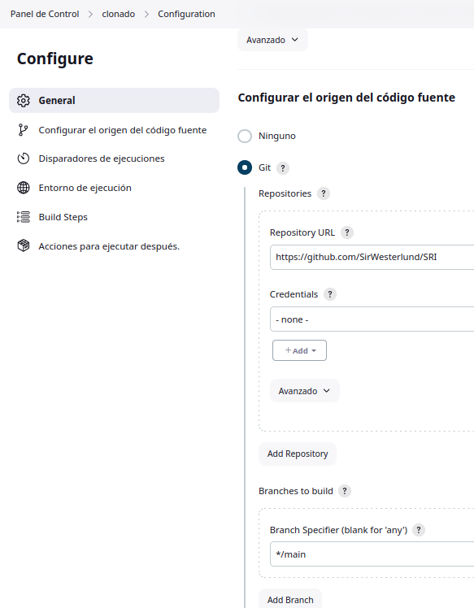
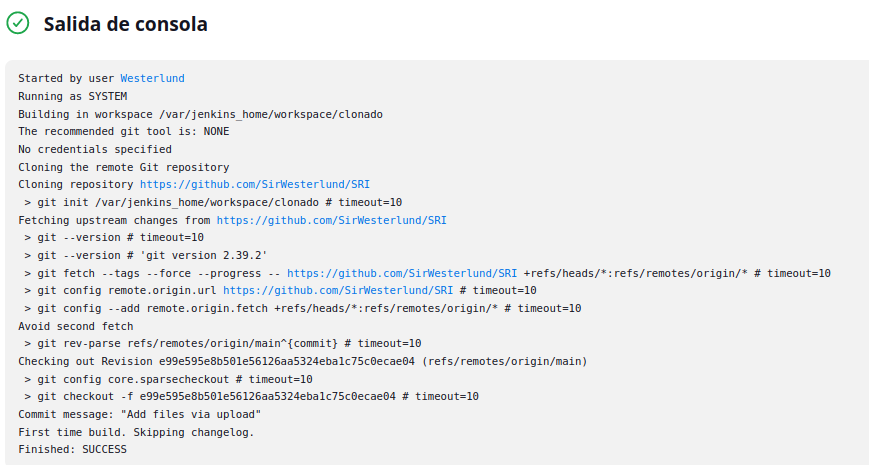
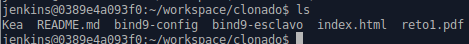
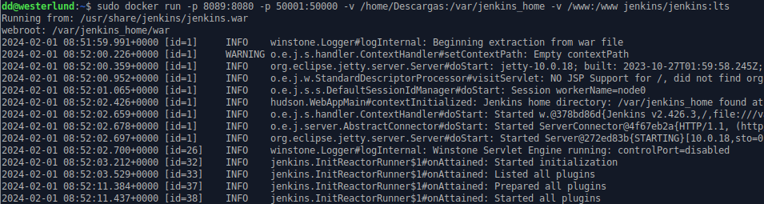
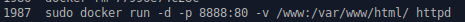
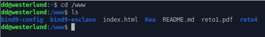
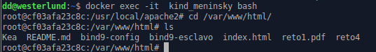
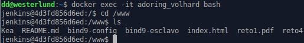

# 
Tarea 2: Freestyle job - despliegue web/git

 Esta es la configuración para descargarnos el repositorio de GitHub, como se ve más abajo, el contenido se ha guardado en el workspace y dentro de él está clonado que es el job que ha relizado la tarea.

 

 

 

Ahora crearemos los volúmenes tras haber logrado el clonado. Aquí tengo los dos comandos con los volúmenes, el de jenkins tiene persistencia y también un volumen a la carpeta /www en mi máquina local y /www para él y el de Apache simplemente el volumen para el clonado del repositorio.

 

 

/www en mi máquina local:

 

/var/www/html en el docker de apache:

 

/www en el docker de jenkins:

 
