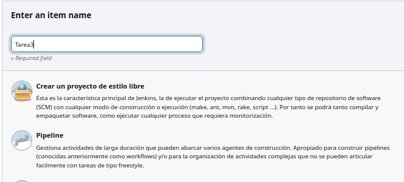

# 
Tarea 3: Tarea 2 con Pipelines

Creamos el pipeline:

 

 

Realizamos estos ajustes dentro de su configuración en la que ponemos "Pipeline script from SCM", nuestra URL de github donde estará el Jenkinsfile y en mi caso la rama "main"

Este es mi Jenkinsfile y mi index.html:

 

 

Comprobamos si funciona ejecutándolo:

 

 

Entro en el docker apache y como se ve, el contenido del index.html es el que toca.

 
