# 
Tarea 4: Creación de nodos (agents)

# Nodo con AWS/SSH

Configuramos las credenciales de nuestra instancia AWS:

 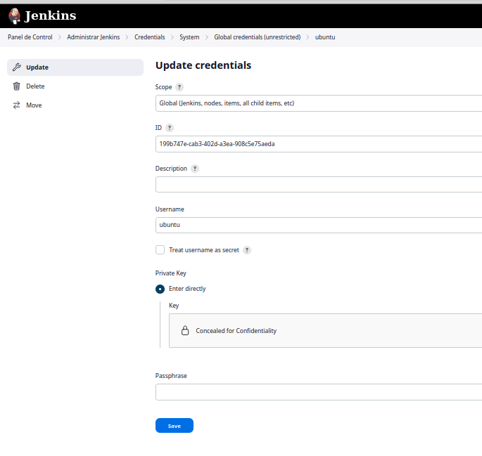

 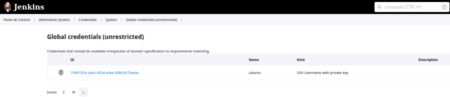

Creamos el nodo que he llamado "SSH" con la siguiente configuración:

 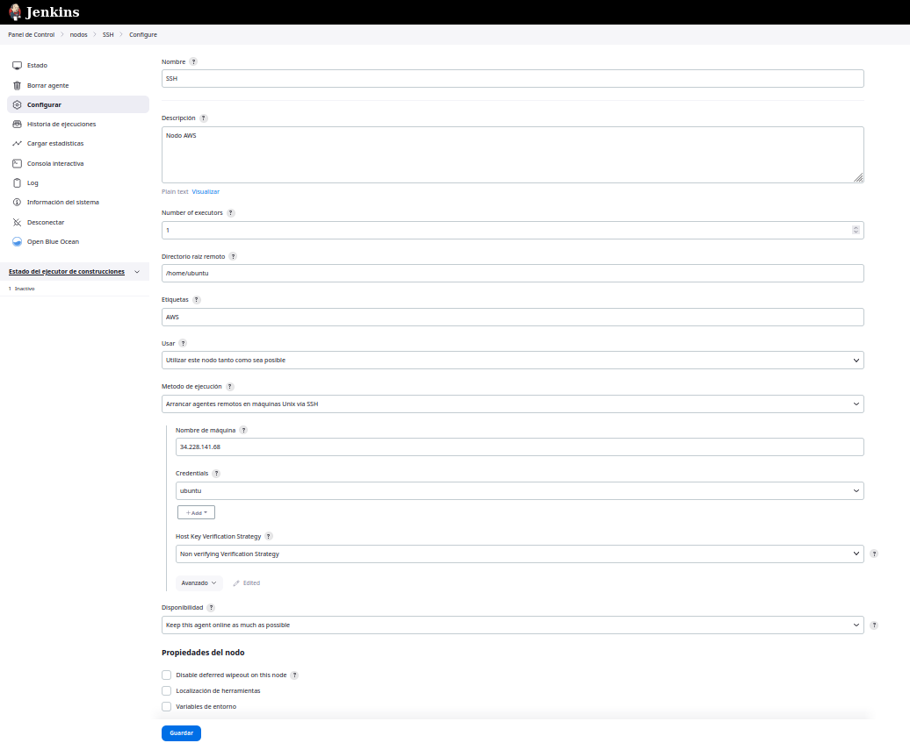

Ahora creamos el pipeline que utilizará la etiqueta que le hemos puesto, en mi caso "AWS":

 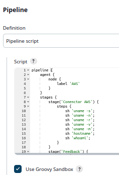

Entonces ahora ejecutamos el pipeline y vemos si ha funcionado:

 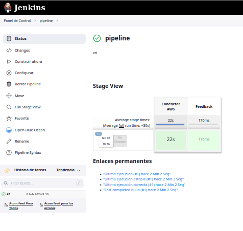

 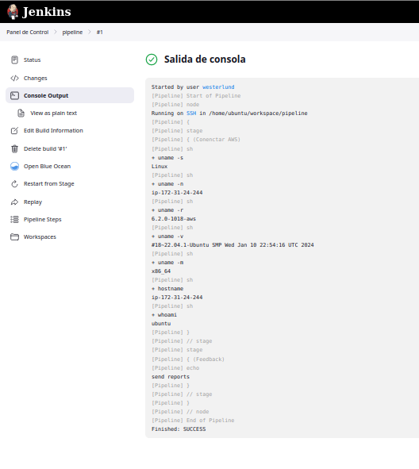

# Nodo con JNLP

Importante tener esto bien configurado, sino no nos funcionará, también crear el nodo, el tener en cuenta en meter los dos docker en la misma red e instalar el paquete "default-jre"

 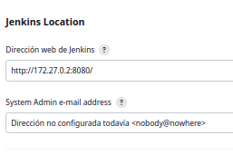

Ahora hacemos los pasos que nos muestra jenkins y debería funcionar tal que así:

 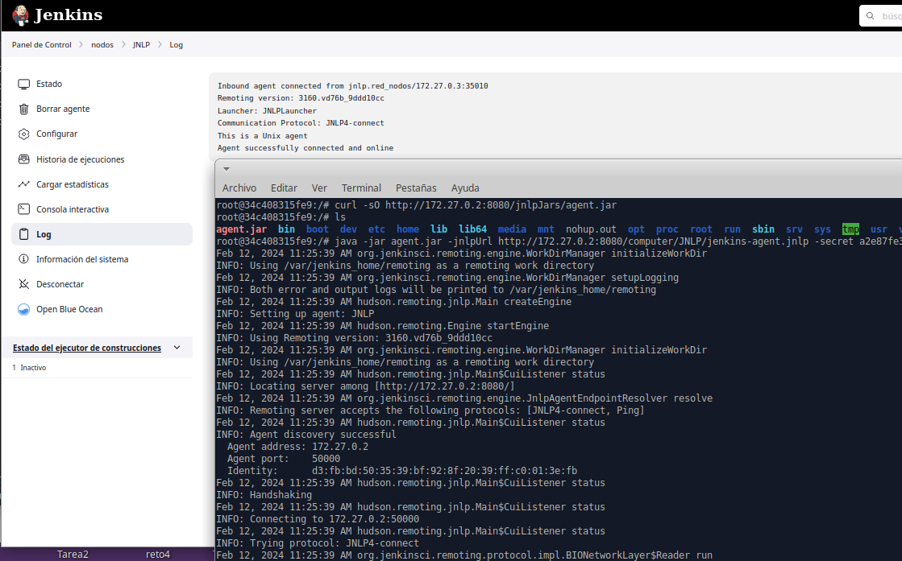

Tras esto, creamos el pipeline para este nodo. Será el mismo proceso que en el anterior:

 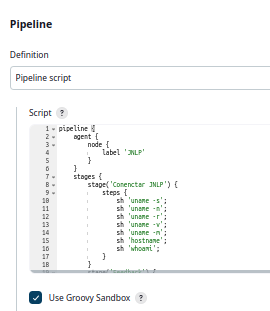

Probamos que funcione:

 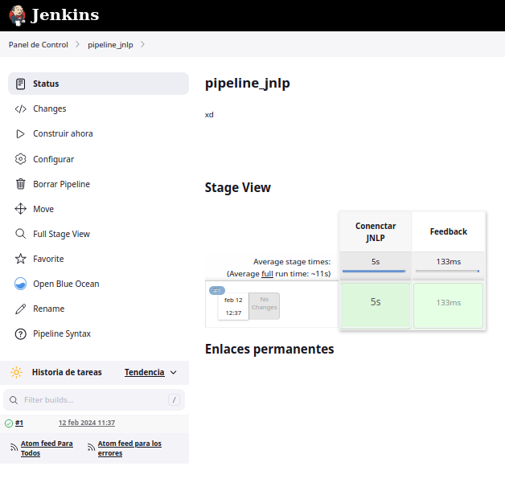
Y vemos su estado:

 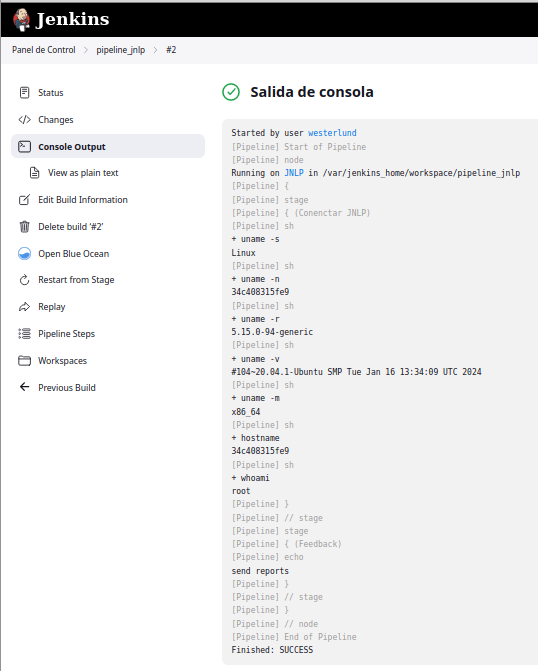
