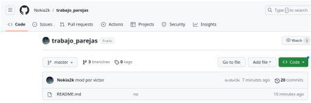
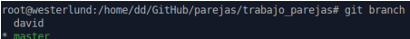
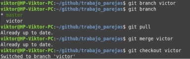
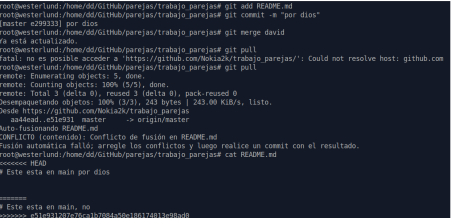
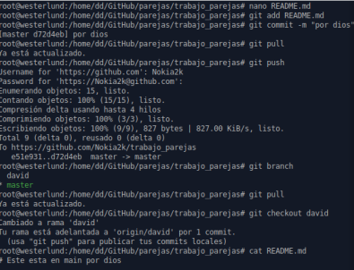
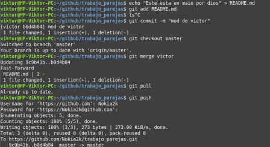

# 
Segunda parte de la tarea: Trabajo por parejas (Victor/David)

## Este documento consta de 3 puntos:

1. Crear un repositorio
2. Trabajar por parejas sobre este repositorio creando ramas y haciendo commits sobre el mismo fichero generando que aparezca un conflicto.
3. Gestión y resolución del conflicto

&nbsp;

## 1. Crear un repositorio

El repositorio lo ha creado Víctor

  
 

## 2. Trabajar por parejas sobre este repositorio creando ramas y haciendo commits sobre el mismo fichero generando que aparezca un conflicto.

Mis ramas:

 

Las ramas de Victor:

 

Aquí modifico e intento actualizar con pull lo que ya está subido por Victor, cosa que termina en conflicto
en mi máquina ya que él tiene subido el archivo README.md con un contenido distinto al que yo tengo,
entonces la manera de solucionar esto es decidir entre nosotros dos qué contenido debe tener README.md,
una vez decidido esto, en nuestro caso nos hemos quedado con la frase de arriba que está debajo el HEAD y
con esto volvemos a realizar todo el proceso para que pueda realizar el push.

 

## 3. Gestión y resolución del conflicto

 Una vez decidido que hacer, en la captura de aquí abajo vuelvo a realizar los mismos pasos que hice anteriormente
y entonces como Víctor y yo tenemos lo mismo, hago el pull y esta vez no da ningún fallo, como se puede ver
hago un cat del README.md y aparece la frase que hemos decidido tener que es la mencionada anteriormente

 

Esto ha sido lo que ha hecho Víctor:

 

---

> Enlace a un markdown de ejemplo [title] (https://github.com/SirWesterlund/prueba_tu_nombre/blob/main/README.md)
