# 
Tarea 1: Instalación / Administración de Wordpress

Usamos el .yml del PDF de la tarea:

 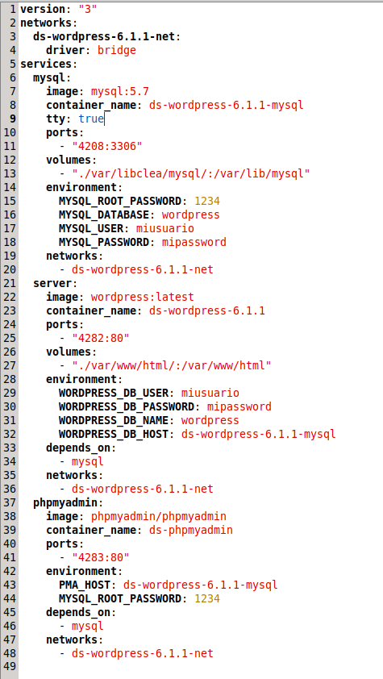

Accedemos por el navegador a Wordpress y lo instalamos, después ponemos nuestras credenciales:

 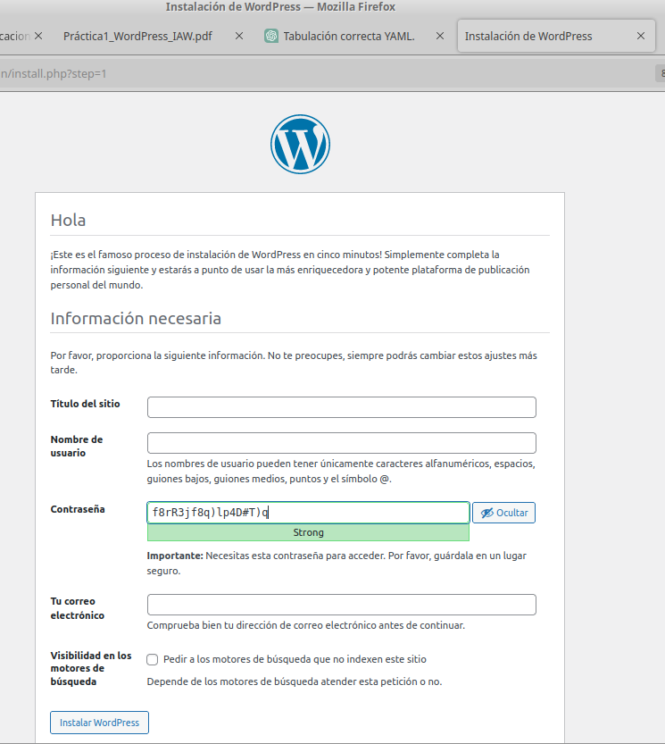

Tras esto nos da la bienvenida y actualizo a la nueva versión 6.4.3:

 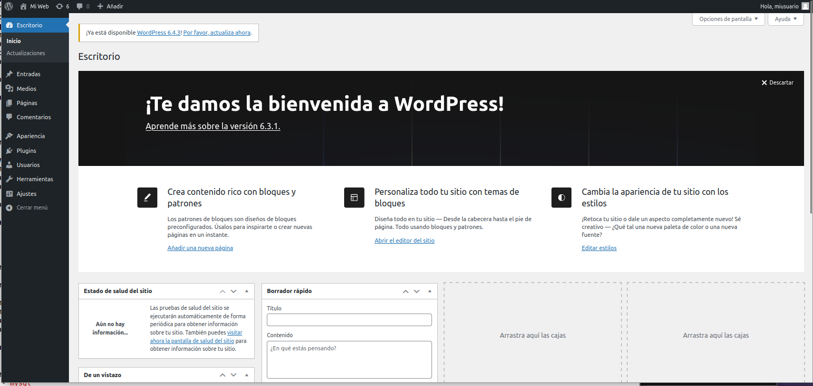

 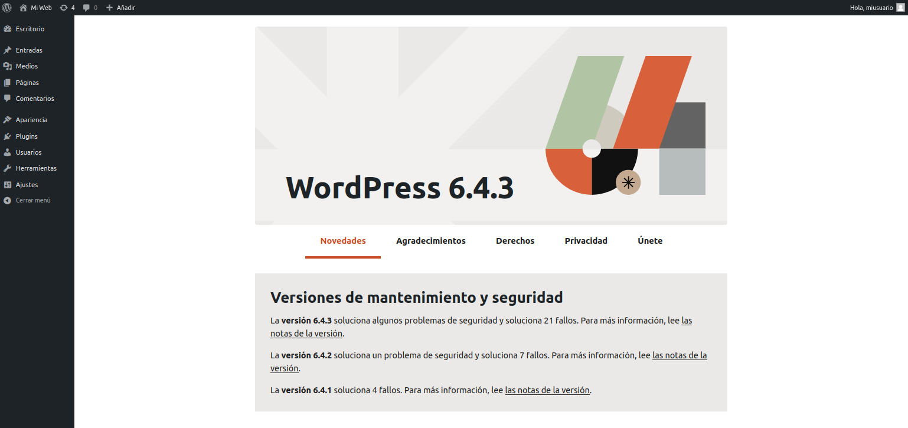

Si al añadir el tema desde el navegador te dice que el enlace caducado hay una solución. Puedes copiar la carpeta "divi" al directorio "themes" del docker de wordpress y posteriormente darle los permisos de www-data y activamos "divi". Lo del child no me funciona asi que tiré con el Divi Builder directamente:

 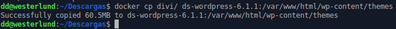

 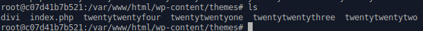

 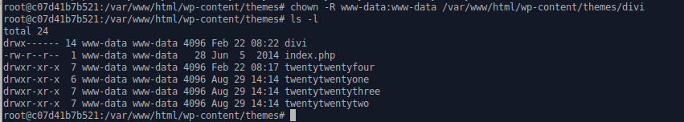

 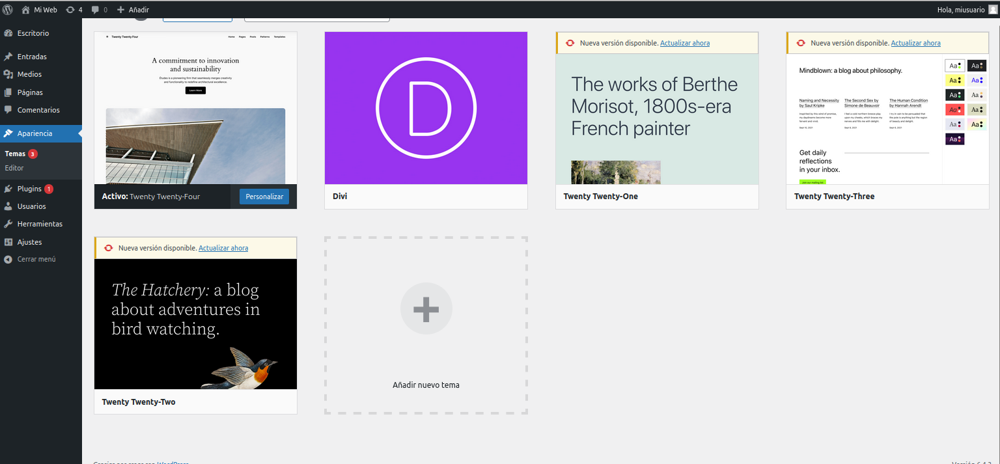

 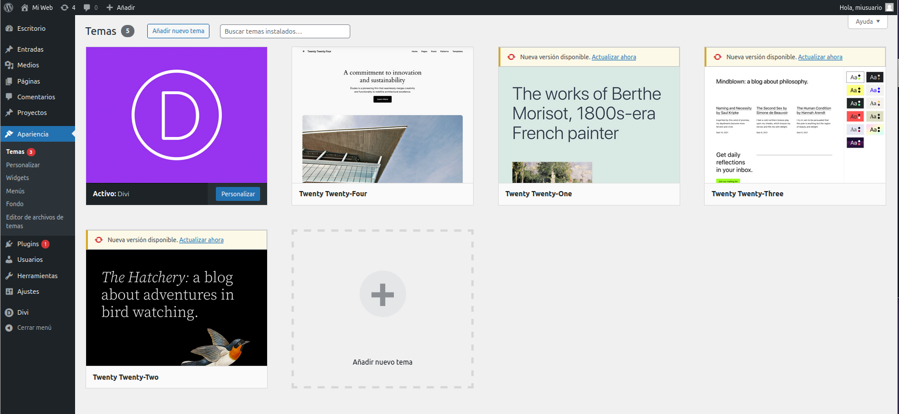

 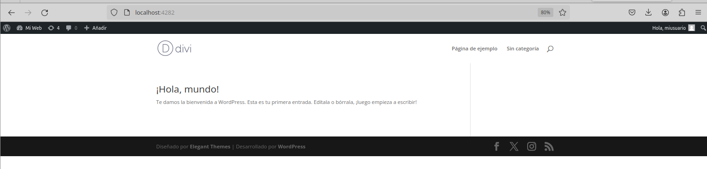

Ahora desde el Divi Builder podemos crear nuevas páginas e importaremos las plantillas json de la escuela. También podemos incluirla como página de inicio:

 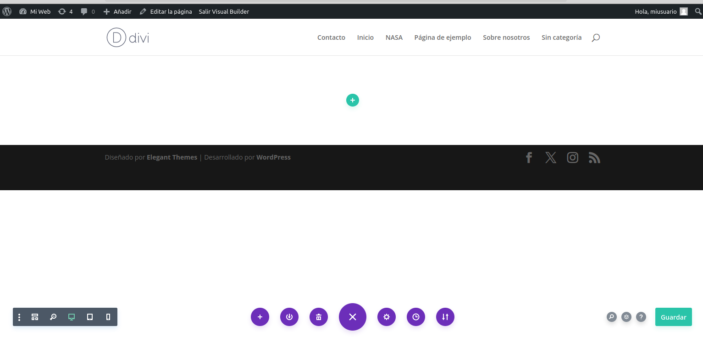

Aquí se ve que he cambiado el logo

 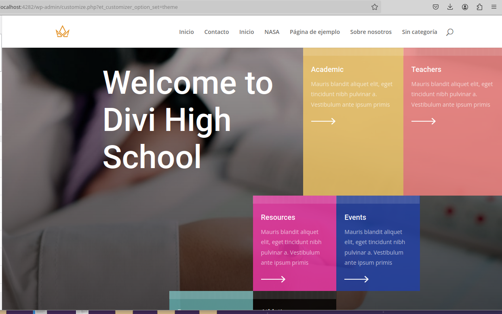

Aquí se ve como cambio el texto, simplemente me pongo encima y lo edito

 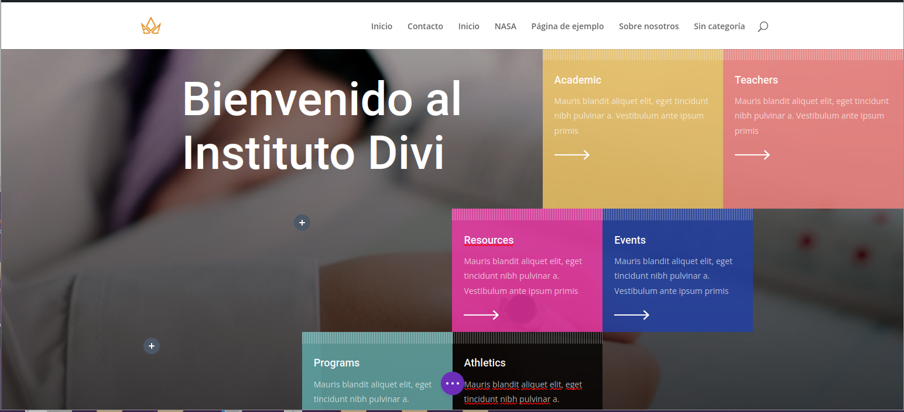

Así es como se puede cambiar el color de fondo.

 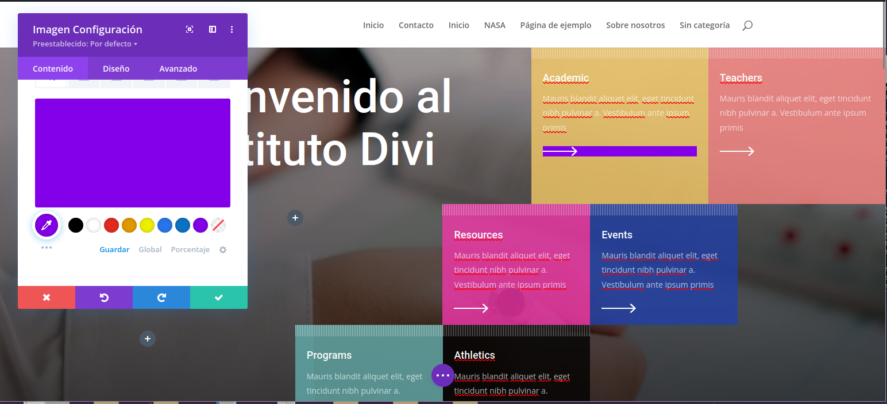

Para borrar el footer por ejemplo nos ponemos encima del borde del footer y podemos clickar en el icono de la papelera para borrarlo

 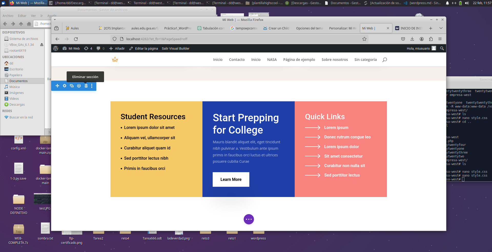

Aquí se ve que le hice una entrada al "blog" que lo he llamado NASA"

 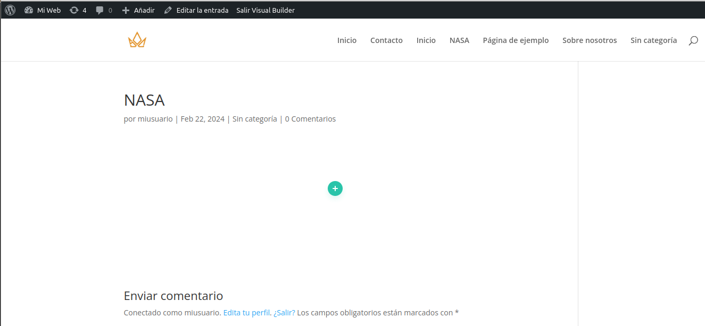

Ya de paso borramos los otros temas que venían por defecto ya que tenemos el nuestro.

 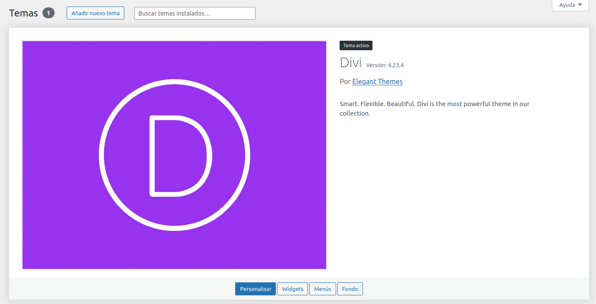
